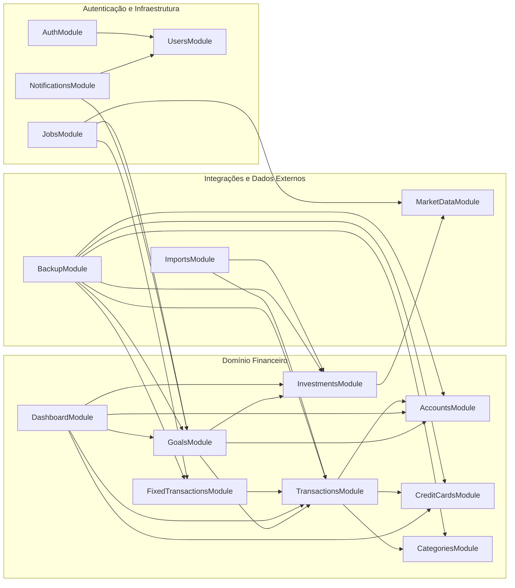

# 📦 Arquitetura de Módulos do Backend

Esta seção descreve a organização do backend em módulos NestJS, seguindo uma abordagem orientada a domínios (DDD light).
O objetivo é manter o código desacoplado, testável e fácil de evoluir à medida que novas funcionalidades forem adicionadas.

## 🌐 Visão Geral

O backend é dividido em três grandes grupos de módulos:

1. **Domínio Financeiro (Core)**
   Contém as regras de negócio diretamente ligadas a contas, transações, cartões, investimentos, metas e dashboard.

2. **Integrações e Dados Externos**
   Responsável por comunicação com APIs externas, importação de extratos e backup de dados.

3. **Autenticação e Infraestrutura**
   Trata de autenticação/autorização, usuários, agendamento de tarefas e notificações.

## 🧱 Diagrama de Módulos (Mermaid)

> Todos esses módulos são importados pelo `AppModule`, que atua como módulo raiz da aplicação NestJS, compondo a arquitetura completa.

## 🔹 Domínio Financeiro (Core)

**AccountsModule**
Gerencia contas bancárias: cadastro, edição, desativação e obtenção de saldos. É usado por `TransactionsModule`, `GoalsModule` e `DashboardModule`.

**CreditCardsModule**
Gerencia cartões de crédito: limite total, valor utilizado, valor disponível e eventual relação com o fechamento da fatura. É usado por `TransactionsModule` e `DashboardModule`.

**CategoriesModule**
Define categorias de ganhos e gastos, utilizadas por transações e metas para organizar e analisar melhor os dados.

**TransactionsModule**
Responsável pelas transações de ganhos e gastos. Implementa:

* CRUD de transações
* filtros por período/categoria
* cálculo de totais
  É um dos módulos mais centrais do sistema.

**FixedTransactionsModule**
Representa as transações recorrentes (fixas). Define regras de recorrência e, em conjunto com `JobsModule`, gera ou sugere transações reais no `TransactionsModule` a cada período.

**InvestmentsModule**
Gerencia investimentos cadastrados (tipo de ativo, valor investido, instituição). Integra-se com `MarketDataModule` para obter o valor atualizado e com `DashboardModule` e `GoalsModule` para análises.

**GoalsModule**
Define metas financeiras (economizar, gastar menos, atingir certo patrimônio). Usa dados de `TransactionsModule`, `AccountsModule` e `InvestmentsModule` para calcular progresso e status das metas.

**DashboardModule**
Agrega dados de vários módulos (Accounts, CreditCards, Transactions, Investments, Goals) para construir a visão consolidada do usuário: saldo total, uso de limite, gastos no período, progresso de metas, etc.

## 🔹 Integrações e Dados Externos

**MarketDataModule**
Integra com APIs externas de mercado financeiro (ações, FIIs, criptos).
Fornece dados de preço e, opcionalmente, caching local. É consumido principalmente pelo `InvestmentsModule` e pelos jobs.

**ImportsModule**
Gerencia importação de extratos de bancos e corretoras (CSV/OFX/XLSX).
Funções principais:

* parsing de arquivos
* normalização de dados
* detecção de duplicatas
* transformação em transações (`TransactionsModule`) ou investimentos (`InvestmentsModule`)

**BackupModule**
Responsável por exportar e importar os dados do sistema em formato estruturado (ex.: JSON).
Acessa os repositórios de todos os módulos de domínio para gerar/restaurar um snapshot completo.

## 🔹 Autenticação e Infraestrutura

**AuthModule**
Implementa autenticação via JWT (login, geração de token, guards).
Protege as rotas dos demais módulos para que apenas usuários autenticados acessem seus próprios dados.

**UsersModule**
Gerencia informações do usuário (mesmo que inicialmente exista apenas um).
Serve de base para preferências, personalização e futuras funcionalidades multi-usuário.

**JobsModule**
Centraliza tarefas agendadas e rotinas de background, como:

* verificar transações fixas em janelas de vencimento
* atualizar periodicamente preços de mercado
* executar rotinas de manutenção/limpeza

Ele conversa com `FixedTransactionsModule`, `MarketDataModule`, `GoalsModule` e outros conforme necessário.

**NotificationsModule** (futuro)
Responsável por enviar notificações ao usuário (por enquanto conceitual).
Pode no futuro integrar com notificações internas, Telegram, e possivelmente WhatsApp Business API.
