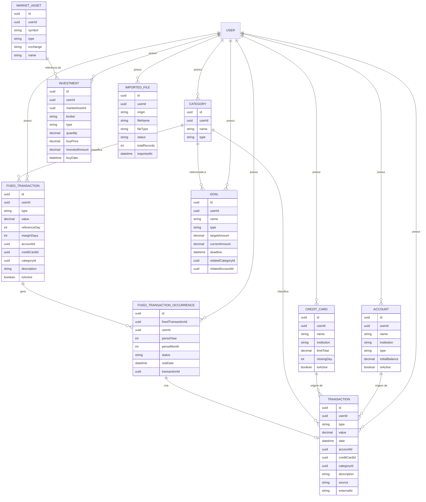

# 🗄️ Modelo de Dados

Este documento descreve o modelo de dados do sistema de finanças, com foco nas entidades principais, seus campos e relacionamentos.
O objetivo é apoiar a implementação do banco de dados (PostgreSQL + Prisma) e garantir alinhamento com as user stories e requisitos funcionais.

> **Nota:**
>
> * IDs serão **UUID** (string).
> * Datas seguirão **ISO 8601**.
> * Nomes de campos aqui são conceituais; na implementação você pode usar `snake_case` no banco e `camelCase` no Prisma/API.

## 1. Visão Geral das Entidades

Entidades principais:

* `User`
* `Account`
* `CreditCard`
* `Category`
* `Transaction`
* `FixedTransaction`
* `FixedTransactionOccurrence`
* `Investment`
* `MarketAsset`
* `Goal`
* (Opcional/futuro) `ImportJob` / `ImportedFile`

## 2. Entidades de Usuário e Contexto

### 2.1. `User`

Mesmo que inicialmente exista apenas 1 usuário, o sistema é preparado para multiusuário futuro.

**Campos principais:**

* `id`: UUID
* `email`: string (único)
* `passwordHash`: string
* `name`: string (opcional)
* `createdAt`: datetime
* `updatedAt`: datetime

**Relacionamentos:**

* 1:N com `Account`, `CreditCard`, `Category`, `Transaction`, `FixedTransaction`, `Investment`, `Goal`, etc. (cada recurso pertence a um usuário).

## 3. Contas e Cartões

### 3.1. `Account`

Representa uma conta bancária (corrente/poupança/outra).

**Campos:**

* `id`: UUID
* `userId`: UUID → `User.id`
* `name`: string (ex.: “Conta Inter”)
* `institution`: string (ex.: “Inter”, “Mercado Pago”)
* `type`: enum (`'checking' | 'savings' | 'other'`)
* `initialBalance`: decimal
* `isActive`: boolean (para não apagar histórico)
* `createdAt`: datetime
* `updatedAt`: datetime

**Relacionamentos:**

* 1:N com `Transaction` (transações ligadas à conta)
* 1:N com `Goal` (metas relacionadas a saldo/conta, se aplicável)

### 3.2. `CreditCard`

Representa um cartão de crédito, com limite e uso.

**Campos:**

* `id`: UUID
* `userId`: UUID → `User.id`
* `name`: string
* `institution`: string
* `limitTotal`: decimal
* `closingDay`: integer (1–31, opcional)
* `isActive`: boolean
* `createdAt`: datetime
* `updatedAt`: datetime

**Relacionamentos:**

* 1:N com `Transaction` (transações daquele cartão)

## 4. Categorias

### 4.1. `Category`

Categorias para ganhos/gastos.

**Campos:**

* `id`: UUID
* `userId`: UUID → `User.id`
* `name`: string (ex.: “Alimentação”, “Transporte”)
* `type`: enum (`'income' | 'expense' | 'both'`)
* `createdAt`: datetime
* `updatedAt`: datetime

**Relacionamentos:**

* 1:N com `Transaction`
* 1:N com `FixedTransaction`
* 1:N com `Goal` (metas por categoria)

## 5. Transações e Transações Fixas

### 5.1. `Transaction`

Representa uma transação **real** que já aconteceu (ganho/gasto).

**Campos:**

* `id`: UUID
* `userId`: UUID → `User.id`
* `type`: enum (`'income' | 'expense'`)
* `value`: decimal (positivo; o tipo define se é crédito/débito)
* `date`: datetime (data real da transação)
* `accountId`: UUID → `Account.id` (opcional, se passou em conta)
* `creditCardId`: UUID → `CreditCard.id` (opcional, se foi no cartão)
* `categoryId`: UUID → `Category.id` (opcional; pode ser `null` para aparecer na tela de “sem categoria”)
* `description`: string (opcional; ex.: “iFood pedido 1234”)
* `source`: enum (`'manual' | 'imported' | 'fixed'`)
* `externalId`: string (opcional; ID do extrato banco/corretora para ajudar na detecção de duplicatas)
* `createdAt`: datetime
* `updatedAt`: datetime

**Relacionamentos:**

* N:1 com `Account` (ou `CreditCard`)
* N:1 com `Category`
* N:1 com `FixedTransactionOccurrence` (quando criada a partir de uma fixa, via `fixedOccurrenceId`, opcional)

### 5.2. `FixedTransaction`

Representa uma transação **recorrente** (fixa), com margem de dias.

**Campos:**

* `id`: UUID
* `userId`: UUID → `User.id`
* `type`: enum (`'income' | 'expense'`)
* `value`: decimal
* `referenceDay`: integer (ex.: 5 = dia 5 do mês)
* `marginDays`: integer (ex.: 3 → janela de 2 a 8)
* `accountId`: UUID → `Account.id` (opcional)
* `creditCardId`: UUID → `CreditCard.id` (opcional)
* `categoryId`: UUID → `Category.id`
* `description`: string
* `isActive`: boolean
* `createdAt`: datetime
* `updatedAt`: datetime

**Relacionamentos:**

* 1:N com `FixedTransactionOccurrence`

### 5.3. `FixedTransactionOccurrence`

Representa a ocorrência de uma transação fixa em um período específico (ex.: aluguel de novembro/2025).

**Campos:**

* `id`: UUID
* `fixedTransactionId`: UUID → `FixedTransaction.id`
* `userId`: UUID → `User.id` (redundante, mas útil pra filtros)
* `periodYear`: integer (ex.: 2025)
* `periodMonth`: integer (1–12)
* `status`: enum (`'pending' | 'confirmed' | 'skipped'`)
* `realDate`: datetime (opcional; data real em que ocorreu, se confirmada)
* `transactionId`: UUID → `Transaction.id` (opcional; preenchido quando uma transação real é criada a partir da ocorrência)
* `createdAt`: datetime
* `updatedAt`: datetime

**Uso:**

* Históricos de confirmações, atrasos ou cancelamentos são extraídos dessa entidade.

## 6. Investimentos e Dados de Mercado

### 6.1. `MarketAsset`

Representa um ativo de mercado (ação, FII, cripto, etc.) para associar investimentos e consultar preços.

**Campos:**

* `id`: UUID
* `userId`: UUID → `User.id` (pode ser `null` se for catálogo global, dependendo da abordagem)
* `symbol`: string (ex.: “PETR4”, “MXRF11”, “BTC”)
* `type`: enum (`'stock' | 'fii' | 'crypto' | 'etf' | 'bond' | 'other'`)
* `exchange`: string (ex.: “B3”, “NYSE”, “BINANCE”)
* `name`: string (opcional, nome descritivo)
* `createdAt`: datetime
* `updatedAt`: datetime

**Possível tabela extra (opcional):**

* `market_prices` para cache de preços históricos ou últimos preços:

  * `id`, `marketAssetId`, `price`, `timestamp`, etc.

### 6.2. `Investment`

Representa um investimento cadastrado pelo usuário (aporte ou posição).

**Campos:**

* `id`: UUID
* `userId`: UUID → `User.id`
* `marketAssetId`: UUID → `MarketAsset.id` (opcional, mas recomendado para associar a preços)
* `broker`: string (ex.: “BTG”, “Binance”)
* `type`: enum (`'stock' | 'fii' | 'crypto' | 'bond' | 'etf' | 'other'`)
* `quantity`: decimal
* `buyPrice`: decimal (preço médio de compra)
* `investedAmount`: decimal (pode ser derivado de `quantity * buyPrice`, mas pode ser armazenado por comodidade)
* `buyDate`: datetime
* `createdAt`: datetime
* `updatedAt`: datetime

**Relacionamentos:**

* N:1 com `MarketAsset`
* N:1 com `User`

> No futuro, você pode adicionar tabelas de movimentação de investimentos (aportes individuais) em vez de apenas posições agregadas.

## 7. Metas

### 7.1. `Goal`

Representa uma meta financeira (economizar, gastar menos, atingir um valor em X tempo).

**Campos:**

* `id`: UUID
* `userId`: UUID → `User.id`
* `name`: string (ex.: “Juntar 10k até o fim do ano”)
* `type`: enum (`'saving' | 'spending-limit' | 'net-worth' | 'custom'`)
* `targetAmount`: decimal
* `currentAmount`: decimal (opcional; pode ser calculado, mas pode ser armazenado para performance)
* `deadline`: datetime (opcional)
* `relatedCategoryId`: UUID → `Category.id` (opcional, para metas por categoria)
* `relatedAccountId`: UUID → `Account.id` (opcional)
* `createdAt`: datetime
* `updatedAt`: datetime

**Possível complemento:**

* Uma tabela de histórico de progresso, se você quiser guardar “snapshots” ao longo do tempo.

## 8. Importação e Backup (conceitual)

### 8.1. `ImportedFile` (opcional, mas útil)

Serve para rastrear arquivos de extrato importados.

**Campos:**

* `id`: UUID
* `userId`: UUID → `User.id`
* `origin`: enum (`'inter' | 'mercado_pago' | 'btg' | 'binance' | 'bipa' | 'coinbase' | 'other'`)
* `fileName`: string
* `fileType`: string (ex.: `text/csv`, `application/xml`, etc.)
* `status`: enum (`'processing' | 'completed' | 'failed'`)
* `importedAt`: datetime
* `totalRecords`: integer
* `createdAt`: datetime
* `updatedAt`: datetime

**Relacionamentos:**

* Pode ter 1:N com uma tabela `ImportedRecord` (opcional) se você quiser guardar logs de cada linha.

### 8.2. Backup

O backup em si é **lógico** (exportar todos os dados do usuário em JSON), não necessariamente precisa de tabela específica.

Mas você pode opcionalmente registrar:

* `BackupLog` com:

  * `id`, `userId`, `exportedAt`, `sizeBytes`, `location` (se subir pra nuvem), etc.

## 9. Diagrama ER (Mermaid)

Um ERD simplificado das entidades centrais:

